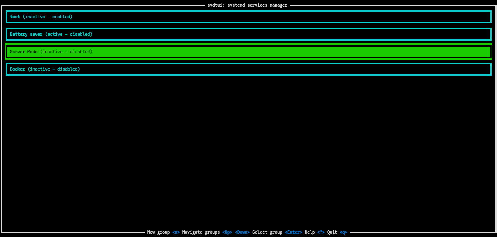
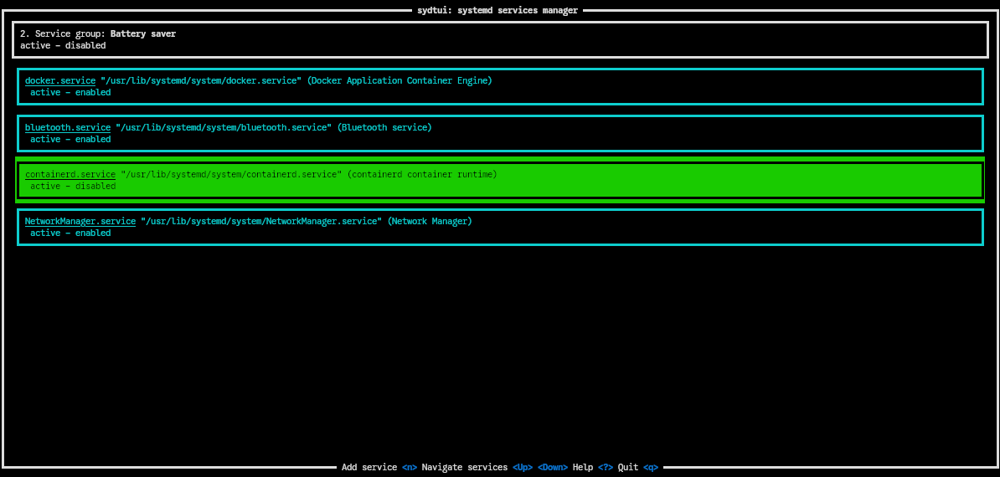
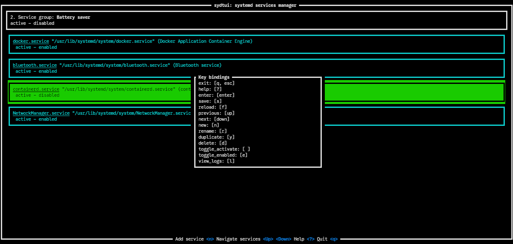

# sydtui
Systemd Services TUI Manager build with [ratatui](https://github.com/ratatui/ratatui).

This program is used to create groups of systemd services to activate/deactivate or enable/disable in bulk.

Some use cases may include creating a group of services to be disabled quickly as a "battery saver" mode, or to quickly enable server-like services when needed.

! **DISCLAIMER**: This utility uses `systemctl` to manage systemd services. `sudo` might be required to fully use this feature. To preserve enviroment variables (for the config path), you can use `sudo -E`.

## Features
You can create, rename, duplicate, and delete service groups, and toggle their activation and enablement in bulk.

You can also activate or enable a single service as well as view their logs.

## Installation
You can use this tool by compiling it from source. You can also download a pre-built binary from the [releases page](https://github.com/arnaudelrio/sydtui/releases).

It is also published at [crates.io](https://crates.io/crates/sydtui), and you can install it via:
```bash
cargo install sydtui
```

### Configuration
Configuration is done via `config.toml`.

The path to the config file can be specified via the `SYDTUI_CONFIG` environment variable. To preserve environment variables when running as root, you can use `sudo -E sydtui`.

Otherwise, the default path is `~/.config/sydtui/config.toml` (again, be careful if the app is run as root).

### CLI usage
If no arguments are provided, `sydtui` will run in TUI mode.

This CLI mode allows for scripting with the created groups of services.

Running `sydtui --help` shows the available options:
```
A TUI for managing groups of systemd services

Usage: sydtui [OPTIONS]

Options:
  -a, --activate <SERVICE_GROUP>  Toggle the activation of a group of services
  -e, --enable <SERVICE_GROUP>    Toggle the enablement of a group of services
  -l, --list                List all available service groups
  -h, --help                Print help
  -V, --version             Print version
```

### TUI Keyboard shortcuts
Keyboard shortcuts are defined in `config.toml`.

The default keybindings are shown below, and can be viewed in the app with `?`.
```
[keybindings]
exit = ["q", "esc"]
help = ["?"]
enter = ["enter"]
save = ["s"]
reload = ["f"]
previous = ["up"]
next = ["down"]
new = ["n"]
rename = ["r"]
duplicate = ["y"]
delete = ["d"]
toggle_activate = [" "]
toggle_enabled = ["e"]
view_logs = ["l"]
```

### Preview




